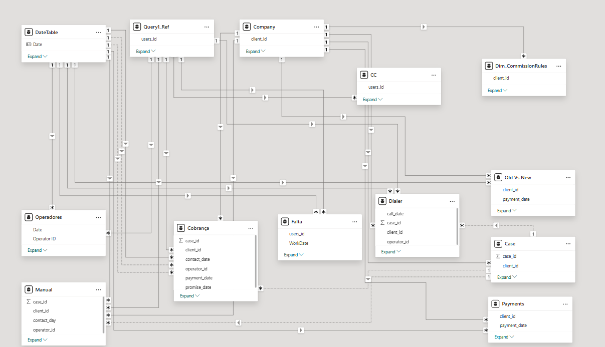
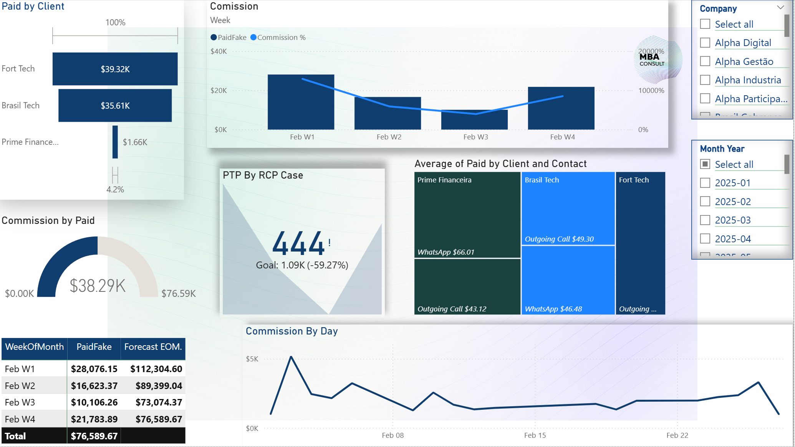

# 💰 Debt Collection Analytics BI

A complete **Data Analytics & Business Intelligence project** focused on **debt collection performance**, combining SQL, Power BI, and data modeling to deliver actionable insights for operational and executive decision-making.

---

## 📊 Overview

This project was designed to analyze and optimize **debt collection operations**, providing full visibility into:

* 📞 Contact performance (Dialer vs Manual vs Digital)
* 🤝 RPC (Right Party Contact) and CPC metrics
* 💸 Payments and PTP (Promise to Pay) conversion
* 🗺️ Geographic distribution of collections (UF level)
* 🏢 Company-level performance analysis
* 👨‍💼 Operator productivity and attendance tracking

The solution follows a **modern BI architecture**, separating data ingestion, transformation, and semantic layers.

---

## 🏗️ Architecture

```text
SQL Server (Raw Data)
        │
        ▼
SQL Layer (Fact & Dimensions)
        │
        ▼
Power Query (Data Transformation)
        │
        ▼
DAX (Business Logic & Metrics)
        │
        ▼
Power BI Dashboard (Visualization)
```

---

## ⭐ Data Model (Star Schema)



The project uses a **star schema model**, ensuring scalability, performance, and analytical flexibility.

### 📌 Fact Tables

* `fact_dialer` → Dialer call attempts
* `fact_contacts` → Unified contact interactions (manual + digital + dialer)
* `fact_ptp` → Promise to Pay events
* `fact_ptp_enriched` → PTP with payment and business logic
* `fact_payments` → Financial transactions

### 📌 Dimension Tables

* `dim_cases` → Contract-level data
* `dim_operator` → Operator information
* `dim_client` → Client/company mapping
* `dim_date` → Calendar and time intelligence

---

## 📈 Key Metrics

The project implements key KPIs used in professional collection operations:

* **CPC (Contact per Call)** → Qualified contact rate
* **RPC (Right Party Contact)** → Effective contact with debtor
* **PTP Conversion Rate** → Contacts that generate payment promises
* **Paid / Contacts**
* **Paid / RPC**
* **Collection Efficiency by DPD**
* **Operator Productivity**
* **Attendance & Absenteeism**

---

## 📊 Dashboard



The dashboard provides:

* 📍 **Geographic view** (Paid by UF)
* 🥧 **Company contribution analysis**
* 📊 **Paid vs Not Paid comparison**
* 📅 Time-based filtering (Month / Year)
* 🏢 Company-level segmentation

---

## ⚙️ Technologies Used

* **SQL Server** → Data extraction and modeling
* **T-SQL** → Fact and dimension creation
* **Power Query (M)** → Data transformation layer
* **DAX** → Business logic and KPI calculations
* **Power BI** → Data visualization
* **Star Schema Modeling** → Data warehouse design

---

## 🧠 Key Features

* ✔ Separation of **Dialer, Manual, and Digital channels**
* ✔ Temporal association between **calls and PTPs**
* ✔ Advanced **business logic for RPC and CPC**
* ✔ Operator-level performance and attendance tracking
* ✔ Scalable and reusable **data model architecture**

---

## 📂 Repository Structure

```text
.
├── dax/
│   └── dim_date.dax
│
├── powerquery/
│   ├── cc_operator_activity.m
│   ├── dim_operators_powerquery.m
│   └── fact_operator_presence.m
│
├── sql/
│   ├── dim_cases.sql
│   ├── dim_client.sql
│   ├── fact_dialer.sql
│   ├── fact_payments.sql
│   ├── fact_ptp.sql
│   ├── fact_ptp_enriched.sql
│   └── fact_contacts.sql
│
├── data-model/
│   ├── star_schema.png
│   └── executive_dashboard.png
```

---

## 🎯 Purpose

This project aims to:

* Demonstrate **real-world data engineering and BI skills**
* Build a **production-level analytics model**
* Showcase **business understanding in debt collection operations**
* Provide a **scalable architecture for data-driven decision making**

---

## 👨‍💻 Author

**Paulo Potter Marchi**
Data Analyst transitioning into **Data Engineering**

Skills:

* SQL
* Data Modeling
* ETL / ELT
* Python
* Power BI
* Data Warehousing

---

## 🚀 Next Steps

Planned improvements:

* Cloud integration (AWS / Azure)
* Orchestration with Apache Airflow
* Real-time data pipelines
* Advanced forecasting models

---

## ⭐ If you liked this project

Feel free to connect and follow my journey into Data Engineering!
